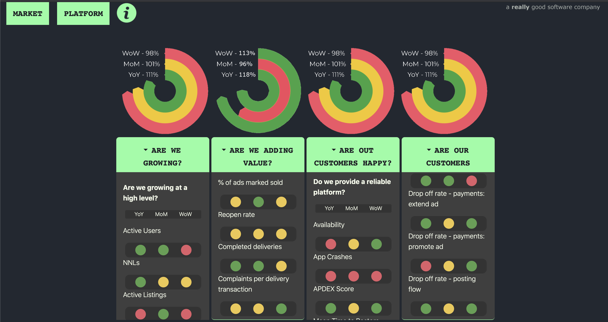

# dotdotdash
a rapid prototype for a simplistic dashboard

Or [Interact with it!](https://htmlpreview.github.io/?https://github.com/fish-taco/dotdotdash/blob/main/Transformers.html)

## transformers.html 
for a novel visualisation of what are toooo many metrics

## radial.html 
for a d3.js render of what the radial donut charts should look like
